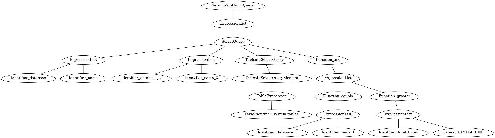

# AST(Abstract Syntax Tree) Samples of ClickHouse Query
Recently I need to parse ClickHouse queries, so I use some sample queries as the input of ClickHouse parse. Let's see the dump tree information.

Ingore the node id in image, it is just

## Case 1: simplest query

Query: Select database, name from system.tables

```
SelectWithUnionQuery, 0x00007f0f64808318
-ExpressionList, 0x00007f0f64821dd8
--SelectQuery, 0x00007f0f648d6018
---ExpressionList, 0x00007f0f64821ec8
----Identifier_database, 0x00007f0f648016d8
----Identifier_name, 0x00007f0f64801798
---TablesInSelectQuery, 0x00007f0f64821e28
----TablesInSelectQueryElement, 0x00007f0f648d6098
-----TableExpression, 0x00007f0f6481c0b8
------TableIdentifier_system.tables, 0x00007f0f64801858
```


## Case 2: column with expression

Query: Select database, name, formatReadableSize(total_bytes), total_bytes/1000 from system.tables

```
SelectWithUnionQuery, 0x00007feb5e610418
-ExpressionList, 0x00007feb5e62add8
--SelectQuery, 0x00007feb5e6de018
---ExpressionList, 0x00007feb5e62afb8
----Identifier_database, 0x00007feb5e6096d8
----Identifier_name, 0x00007feb5e609798
----Function_formatReadableSize, 0x00007feb5e6371d8
-----ExpressionList, 0x00007feb5e62b058
------Identifier_total_bytes, 0x00007feb5e6099d8
----Function_divide, 0x00007feb5e6372b8
-----ExpressionList, 0x00007feb5e62af18
------Identifier_total_bytes, 0x00007feb5e609918
------Literal_UInt64_1000, 0x00007feb5e610318
---TablesInSelectQuery, 0x00007feb5e62ae28
----TablesInSelectQueryElement, 0x00007feb5e6de098
-----TableExpression, 0x00007feb5e6250b8
------TableIdentifier_system.tables, 0x00007feb5e609b58

```


## Case 3: where condition

Query: Select database, name from system.tables where database='msn_prod' and total_bytes > 1000

```
SelectWithUnionQuery, 0x00007f6394a08318
-ExpressionList, 0x00007f6394a21dd8
--SelectQuery, 0x00007f6394ad6018
---ExpressionList, 0x00007f6394a21ec8
----Identifier_database, 0x00007f6394a016d8
----Identifier_name, 0x00007f6394a01798
---TablesInSelectQuery, 0x00007f6394a21e28
----TablesInSelectQueryElement, 0x00007f6394ad6098
-----TableExpression, 0x00007f6394a1c0b8
------TableIdentifier_system.tables, 0x00007f6394a01858
---Function_and, 0x00007f6394a2e2b8
----ExpressionList, 0x00007f6394a21fb8
-----Function_equals, 0x00007f6394a2e1d8
------ExpressionList, 0x00007f6394a21f68
-------Identifier_database, 0x00007f6394a01918
-------Identifier_msn_prod, 0x00007f6394a019d8
-----Function_greater, 0x00007f6394a2e398
------ExpressionList, 0x00007f6394a220f8
-------Identifier_total_bytes, 0x00007f6394a01a98
-------Literal_UInt64_1000, 0x00007f6394a08218

```


## Case 4: group by

Query: Select database, name from system.tables where database='msn_prod' and total_bytes > 1000 group by database,name

```
SelectWithUnionQuery, 0x00007f2321e10318
-ExpressionList, 0x00007f2321e2add8
--SelectQuery, 0x00007f2321ede018
---ExpressionList, 0x00007f2321e2aec8
----Identifier_database, 0x00007f2321e096d8
----Identifier_name, 0x00007f2321e09798
---TablesInSelectQuery, 0x00007f2321e2ae28
----TablesInSelectQueryElement, 0x00007f2321ede098
-----TableExpression, 0x00007f2321e250b8
------TableIdentifier_system.tables, 0x00007f2321e09858
---Function_and, 0x00007f2321e372b8
----ExpressionList, 0x00007f2321e2afb8
-----Function_equals, 0x00007f2321e371d8
------ExpressionList, 0x00007f2321e2af68
-------Identifier_database, 0x00007f2321e09918
-------Identifier_msn_prod, 0x00007f2321e099d8
-----Function_greater, 0x00007f2321e37398
------ExpressionList, 0x00007f2321e2b0f8
-------Identifier_total_bytes, 0x00007f2321e09a98
-------Literal_UInt64_1000, 0x00007f2321e10218
---ExpressionList, 0x00007f2321e2b238
----Identifier_database, 0x00007f2321e09b58
----Identifier_name, 0x00007f2321e09c18
```




#### Draw Image
The trees are drawn by [Graphviz](https://graphviz.org/doc/info/command.html), mannually write graph text now.