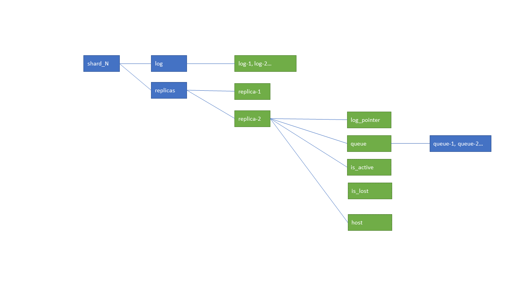

# ReplicatedMergeTree Background Thread 之 Log Clean

ReplicatedMergeTree作为ClickHouse很经典的Engine, 会有很多后台线程来保证表的操作和数据的正确执行。ReplicatedMergeTree主要用于同一个分片在多个表之间保证数据同步和一致，通常会在不同的机器上，一台机器宕机后，整个服务还是可以正常运行。

ReplicatedMergeTree重度依赖Zookeeper来保存数据的meta信息（比如parts, replicas），每个replica都会读取zookeeper下同一个分片下的很多信息。下面介绍log entry的删除逻辑。

[!ReplicatedMergeTreeCleanupThread](https://clickhouse.tech/codebrowser/html_report/ClickHouse/src/Storages/MergeTree/ReplicatedMergeTreeCleanupThread.cpp.html
)

## Related znodes
你可以通过zookeeper提供的client连接到zookeeper server上查看当前运行的节点（如果你没有尝试过，请参考[查看zookeeper节点](!https://zookeeper.apache.org/doc/r3.4.8/zookeeperStarted.html)）。对于一个数据分片，zookeeper 和 log 删除相关的节点信息如下：

* log

    log包含了所有要执行的log, log中的number是自增的。replica会把log pull到自己的queue.

* replicas

    包含了此分片下的所有replica(通常为机器名), 图中示例有两个replica, 分别为 replica1, replica2.

* replica2
    
    此分片下的一个replica.

* log_pointer

    log_pointer 代表了下一个要从 log 中要pull到自己queue的元素。如果所有元素都已经pull到当前replica的queue了，能看到log_pointer是 log 中的最大值加 1.

* queue

    很多command都存放在queue中。replica会将command从log中pull到自己的queue中。所有类型的command都在queue中，如 GET_PART, MERGE_PART, MUTE_PART。queue中的command执行不一定是按顺序的。因为在replica上的表，会对不同的command有设定，比如merge queue允许最多16 个merge。

* is_active

    Zookeeper中的临时节点。Zookeeper中的节点分为永久节点和临时节点。永久节点在client和zookeeper失去连接时，不会删除； 但临时节点会在连接断开时，被删除掉。 is_active节点只有在replica表被加载时才会创建，表明当前replica时否活着；replica了之后，is_active会被删掉。

* host

    当replica每次被加载时，除了创建is_active结点外，host结点也会被修改，比如这次启动的时间等。节点被修改一次，结点的dataversion(通过zookeeper的 state 命令查看) 就会加1。比如在做log删除的过程中，如果host的dataversion变化了，证明replica又重新加载了，这个时候就不做操作。

* is_lost

    正常情况下，is_lost节点的值为0， 代表没有lost。只要replica active, 其未被pull到自己queue中的log肯定不会被删除。但是如果有log还未被pull到自己queue中就要被删除，此时is_lost 节点要被标记为1， 代表有的log已经丢失了。

# log znode的清理过程

为什么要清理log? 因为ClickHouse merge/mutation/get 等一系列的操作都会产生log, znode不可能无限多，所以过期的，没用的log就可以清理掉。 如何知道哪些log 对于replica来说是过期的？通过 log_pointer 判断。

由于log 是按顺序递增存放的，从log中pull到 replica 自己的queue 中时也是按顺序的。因此 每个replica只需要记录当前处理的log在哪个位置即可，这个信息存放在每个replica 下的 log_pointer中。 由于 ClickHouse 设置了 最小的log数量（可能是方便debug）, 所以你会看到，即使所有的replica 的log都pull到replica的queue中了（通过log_pointer查看），但是log还是没有被完全删掉。

所以在清理的过程中，就是找到最小的 log_pointer。 最小的log_pointer之前的 log 是可以被删掉的，只不过在这里要处理一下特殊的情况。

大概的逻辑如下（有的分支条件已简化，具体的请看code。如下的过程只是说明大概思想。）

* replica是否active
    
    通过是否存在is_active node判断。

    * 如果当前节点是active， 直接查看log_pointer。对于active的节点，永远不会删除还没有pull到queue中的 log。
    
    * 如果当前节点is_active 不存在，证明这个replica的表已掉线。掉线以后，log还是会增加（其他replica触发），但是本replica log_pointer不变。所以不可能无限制的给一个 非active的表留着，这个时候就会通过设置的 最大的log 数来判断。 
    
        如果 log_pointer 指向的节点在 最近的 **设置的最大log数** 之中，那replica不会将没处理的log节点删掉; 如果  log_pointer 指向的节点不在 最近的 **设置的最大log数** 之中， log_pointer太老了，这时就不管这个replica了，会把这个replica 的 is_lost 节点置为1， 表明已经有 log 丢失。

    遍历所有replica, 找到最小的log_pointer, 就可以进行删除操作了，把小于log_pointer的节点都可以删除了。

    is_lost 节点时后续版本加的，所以会有逻辑判断是否存在此节点。

    
    
