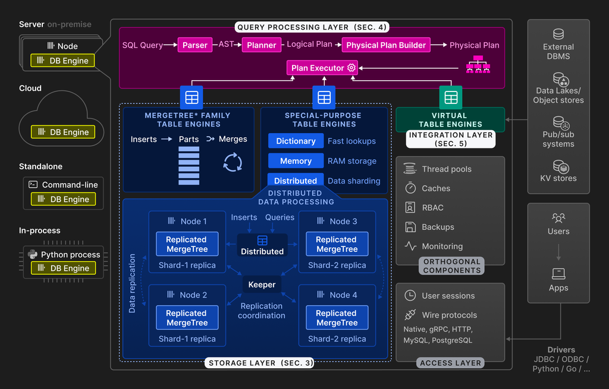

# Background

When we want to find business insights from Bing logs, the old way is to submit cosmos job and wait for the results. It has several problems:

* Job needs to acquire tokens, maybe wait.

* Job may run long time, at least several minutes for light weight job, for jobs running > 30m is very common.

* Submit job is not friendly for users like PM, managers.

So we want to find a way to analysis data without submitting jobs. The investigation result is Clickhouse(backend engine) + Superset(front end).

Clickhouse is famous for its fast engine.

# Scenarios

It targets large data set, PB level, for logs, traces and data that update operation frequency is low.

# Clickhouse good points

## Fast
Reference [Why Clickhouse is so fast](https://clickhouse.com/docs/concepts/why-clickhouse-is-so-fast) for more detail.

### Storage
* Columnar storage

    Only needed columns' data are read, it reduces IO time.

* Concurrent inserts are isolated from each other

    Data is inserted by many data parts, each data part is isolated. The insert rate is performed almost at the speed of disk I/O.

* Concurrent inserts and selects are isolated
    Data inserts are in background, select operations aren't be influnced.

* Merge-time computation
* Data Pruning

    The target is to read as less data as possible, so the data is
    * primary key indexe
    * [TODO: projection principle ] table projections

* Data compression

    Clickhouse can specify each column's compression method, and different compression method can suite for different data types. The 

### Query Execution
It parallized the query execution.

* multi-core to execution query for disjoint part of the data.
* Vectorized query exectution, it doesn't return data by each row, but block of data. So it used the CPU cache and also it uses the SIMD to parralize the query execution.

## External Integrations

From the aritecture of Clickhouse, we know that Clickhouse did many integrations, like kafka, mysql, sqlserver, redis, data lake etc.

# Clickhouse bad points

* Compute and storage are coupled.
* Data format is not compatible with other platform, it only recognized by Clickhouse.

# References
[VLDB 2024 - ClickHouse: Lightning Fast Analytics for Everyone - Web](https://clickhouse.com/docs/academic_overview#3-1-on-disk-format)

[VLDB 2024 - ClickHouse: Lightning Fast Analytics for Everyone - Youtube](https://www.youtube.com/watch?v=7QXKBKDOkJE)

[Why Clickhouse is so fast](https://clickhouse.com/docs/concepts/why-clickhouse-is-so-fast)

